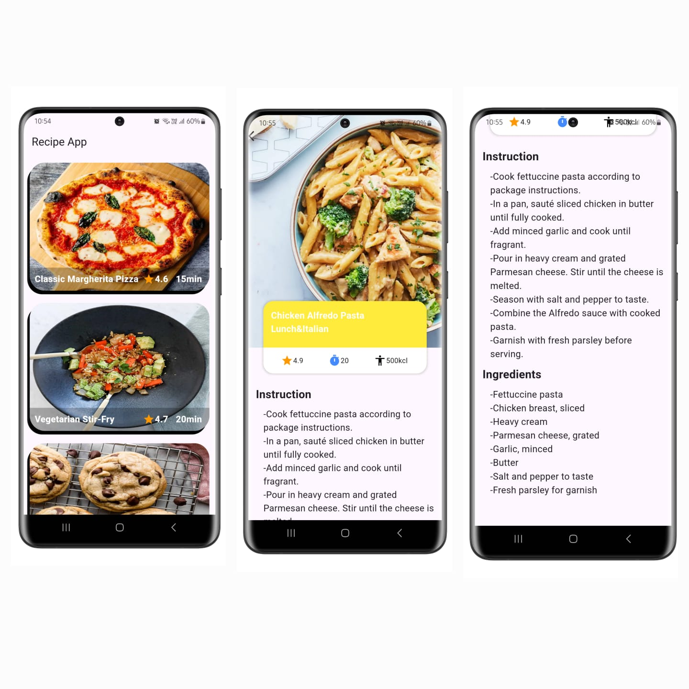

# recipe_app

A new Flutter project.

## Getting Started

This project is a starting point for a Flutter application.
## App Features
-Recipe List
-Detailed View
-Cooking Instructions
-Ingredients List
-User-Friendly Design

## How to run the app
To run the app, you'll need to set up Flutter and Dart on your machine.

Steps:

Download Android Studio from the official website: https://developer.android.com/studio
Download JDK from the official website: https://www.oracle.com/java/technologies/javase-jdk11-downloads.html
Download the Flutter SDK from the official website: https://docs.flutter.dev/release/archive
Download sdk version 3.22.1
Unzip the downloaded Flutter SDK into a directory of your choice
Open Android Studio and install Flutter & dart plugin
Set up Flutter SDK in your system environment variables
Specify the Flutter SDK path in your Android Studio settings

A few resources to get you started if this is your first Flutter project:

- [Lab: Write your first Flutter app](https://docs.flutter.dev/get-started/codelab)
- [Cookbook: Useful Flutter samples](https://docs.flutter.dev/cookbook)

For help getting started with Flutter development, view the
[online documentation](https://docs.flutter.dev/), which offers tutorials,
samples, guidance on mobile development, and a full API reference.
